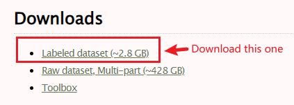
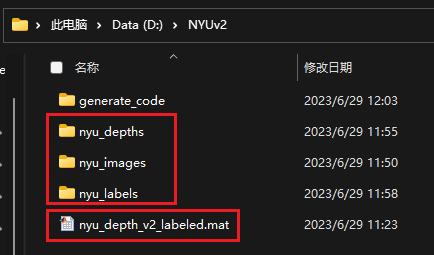

<!--
 * @Author: SimonHanYANG SimonCK666@mail.163.com
 * @Date: 2023-06-29 12:01:26
 * @LastEditors: SimonHanYANG SimonCK666@mail.163.com
 * @LastEditTime: 2023-06-29 12:10:55
 * @FilePath: \generate_code\README.md
 * @Description: 这是默认设置,请设置`customMade`, 打开koroFileHeader查看配置 进行设置: https://github.com/OBKoro1/koro1FileHeader/wiki/%E9%85%8D%E7%BD%AE
-->
# Gnenerate NYUv2 RGB, Depth, Lable

## Download NYUv2 Dataset

- **Official Webset**: https://cs.nyu.edu/~silberman/datasets/nyu_depth_v2.html



## Create Python Environment

```cmd
conda create -n nyuv2dataset python=3.9

pip install -r requirement.txt

or

pip install -r requirement.txt -i https://pypi.tuna.tsinghua.edu.cn/simple

```

## Generate RGB, Depth, Label

- Generate RGB: `generate_RGB_image.py`
- Generate Depth: `generate_Depth_image.py`
- Generate Label: `generate_Label.py`

## Generate Results


